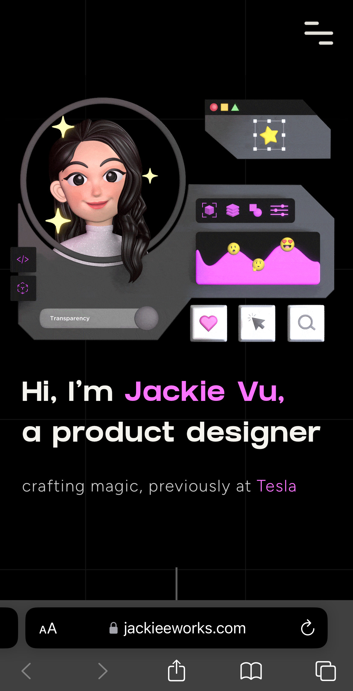
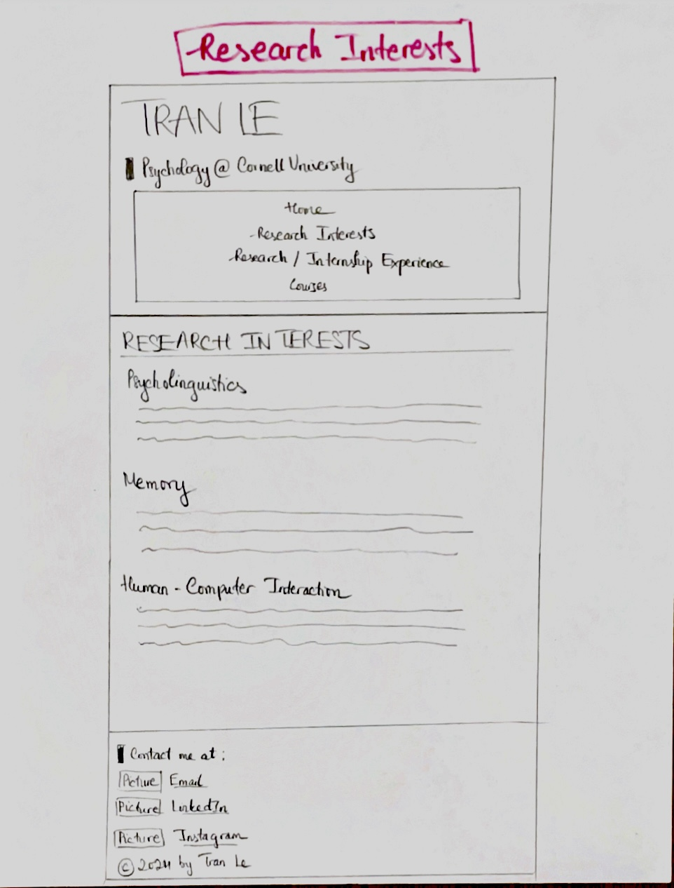
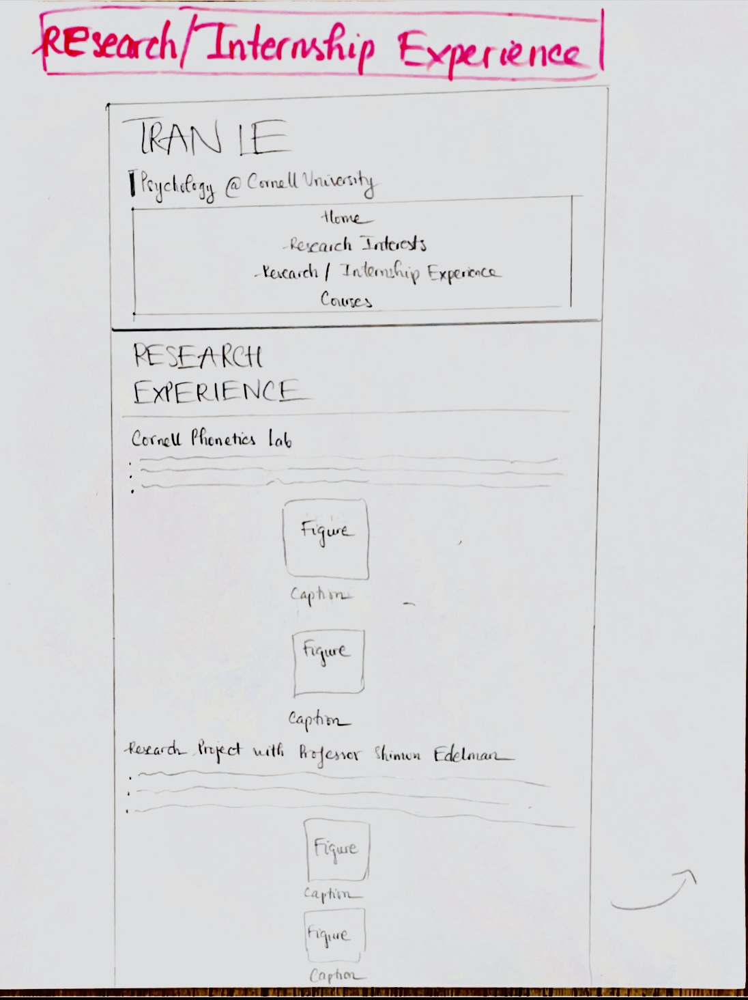
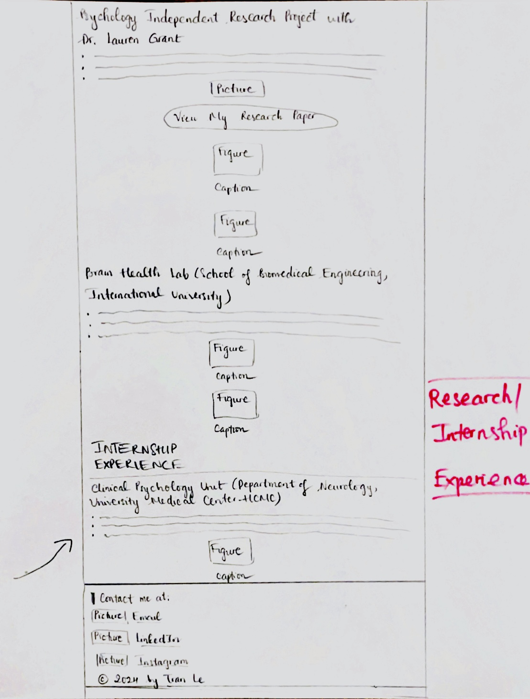
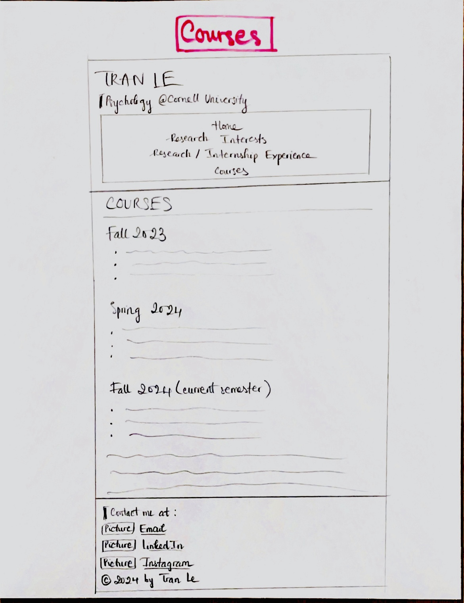

# Project 1, Final Milestone: Design Journey

[← Table of Contents](design-journey.md)

**Replace ALL _TODOs_ with your work.** (There should be no TODOs in the final submission.)

Be clear and concise in your writing. Bullets points are encouraged.

Place all design journey images inside the "design-plan" folder and then link them in Markdown so that they are visible in Markdown Preview.

**Everything, including images, must be visible in _Markdown: Open Preview_.** If it's not visible in the Markdown preview, then we can't grade it. We also can't give you partial credit either. **Please make sure your design journey should is easy to read for the grader;** in Markdown preview the question _and_ answer should have a blank line between them.

## Milestone 3 Feedback Revisions
> Explain what you revised in response to the Milestone 3 feedback (1-2 sentences)
> If you didn't make any revisions, explain why.

I didn't make any revisions because I didn't get my points deducted for any criteria.

## Example Website Emotion Analysis

For each example website you identified in milestone 1:

1. Include the same screenshot of the example website you included in Milestone 1.
2. Reflect on the emotions your experience when using the website.
3. Analyze how the website's use of color, decorative imagery, typography, shape, and alignment contribute to these emotions.

### Example Website 1
> Provide the website's URL and a screenshot

<https://www.jackieeworks.com>

> What emotions do you feel when you look at this website's design? (1 sentence)

I feel focused and eager to explore the website more because it conveys a sense of futuristic creativity, professionalism, and innovation.

> How does this website's use of color, decorative imagery, typography, shape, and alignment contribute to these emotions? (2-3 sentences)

Regarding color, the website's colors are mainly monochromatic, with some details adorned with pink and purple. This choice of colors creates a minimalistic but futuristic & creative style. Regarding decorative imagery, the designer mainly uses animated images/icons that contribute to the design's innovative and futurisitc feeling. Regarding the typography, most texts are normal, but the headings are bold, so it's really readable for readers. Regarding shapes, the links are shaped like buttons, so they signify important features to click, creating a convenient feeling for readers. Regarding alignment, the website's designer didn't use centering alignment too much, and there's logical spacing between elements. This alignment choice contributes to a balanced and structured layout, which also conveys a sense of professionalism.

### Example Website 2
> Provide the website's URL and a screenshot

<https://ngoclinhdannguyen.wixsite.com/lindanguyenportfolio>

> What emotions do you feel when you look at this website's design? (1 sentence)

I feel vitalized, lively, and captured but I feel quite overwhelmed a bit.

> How does this website's use of color, decorative imagery, typography, shape, and alignment contribute to these emotions? (2-3 sentences)

Regarding color, the website's author mainly uses black and white but uses other colors to match the theme of her projects' designs. This color choice makes me more focused and engaged in her work's designs while also feeling enthusiastic. Regarding imagery, she uses many images that are her work's designs, adding a sense of vibrancy and visual richness. However, the images aren't properly resized (i.e., still quite big, so I need to click in to view them in detail), leading to feelings of overwhelm. Regarding typography, she uses a familiar font size and appropriate boldness for headings, making me comfortable when reading the content. Regarding shapes, there isn't an excessive use of borders, so the website creates a sense of openness and doesn't make me feel confined. Regarding alignment, she quite constantly used different forms of alignments, so I often had to direct my eye view to different places, which was somehow distracting.

## Website Design

### Emotion Reflection
> What emotions would you like the visitors of your website to experience? Why? (1-2 sentences)

Since my audience is psychology researchers interested in hiring research undergraduates, I want to build a sense of professionalism, credibility, and reliability. I'd also like my audience to feel curious and engaged and think that my website is memorable so that they can explore my content further. I want them to feel energized by my website and think that I'm an energetic person, considering the various research/internship activities I participate in. Additionally, I want to foster a sense of passion and connection so that the researchers feel more inclined to hire me.

### Design Principle Brainstorm
> Reflect on how you might use color, decorative imagery, typography, shape, and alignment to evoke these emotions. (2-3 sentences)

Regarding color, I intend to mainly use a background color of white and a text color of black to convey a sense of professionalism. Academic websites usually follow that theme, so if I do that, my website will be more familiar and reliable to the audience. Since I'm an undergraduate student at Cornell and I want to mainly work at Cornell labs, using the Cornellian red would also create a sense of connection. Red can also evoke emotions such as excitement, passion, and engagement. It also works well with a white background color because it strongly contrasts with white. Thus, I would use red for some headings, important details, and button-shaped links to better grab the audience's attention and call for their action to click the links. I would also use red as a background color and white as a text color for the box for my header and footer to make my website less monotonous, more memorable, and more engaging.

Regarding decorative imagery, I would use Email, LinkedIn, and Instagram icons located next to the respective text "Email," "LinkedIn," and "Instagram" in my contact section. I would also include resume and research paper icons above the respective link in the button-shaped boxes. They would make my website more visually appealing, give the audience the impression that I'm energetic, and ensure the important details stand out, thus providing ease of navigation for the audience and keeping them actively exploring my website.

Regarding typography, I would use sans-serif fonts and only italicize/underline some important details for readability and a contemporary feeling, which can convey professionalism. I would also establish a clear hierarchy with font sizes: headings will have a larger font size, while normal text in sections will have a smaller font size. This typography choice would make researchers feel comfortable and engaged because they can read and locate content conveniently and quickly.

Regarding shape, I would use bottom borders mostly for higher-level headings to divide/emphasize the content for readability. I'd also include a left border for my headline and contact information to make them stand out. Since they are both located in the header and footer, using consistent styling for both would make my website more structured and well-planned. Additionally, I'd also like the boxes for the links to look like buttons to capture audiences' attention to them. Overall, I won't use a lot of borders to keep the website professional and not overwhelming so that readers can focus more on the academic content, not other unnecessary details.

Regarding alignment, I would mainly use left-aligned text to create a consistent starting point for each line, making it easier to read. Since my website has some long passages of text, doing so would help reduce cognitive load and contribute to professionalism. I would only use center alignment for figures, the navigation menu, and the button-shaped links to draw the audience's attention directly to the images and the pages/links, thereby enhancing engagement.

### Home Page Sketches
> Sketch **two** different possible designs for your home page.
> Provide an explanation for each sketch explaining the idea. (1 sentence per sketch)

In my first home page sketch, the page is divided into three sections: header, main, and footer for a clear structure. In the header, the navigation menu contains links shaped like buttons. It also has a center alignment and is located above my name and headline. I style a left border for my headline to make it attention-capturing without being too aggressive. Then comes my heading "INTRODUCTION" accompanied by a thin border below it. The content is then my headshot, a paragraph introducing myself, some bullet points (GPA, languages, skills), a picture (icon) located to the left of the left-aligned button "View My Resume," an indented quote, and a paragraph prompting the audience to go explore my other pages. The quote will be shaped in a box. The footer has my contact and copyright information. I also use a left border for "Contact me at:" and include related pictures (icons) next to the contact links to add clarity and help the audience quickly identify how to get in touch with me. I then center-align my copyright information at the bottom of the page.

In my second home page sketch, the page is also divided into three sections: header, main, and footer. However, I styled the navigation menu as a box inside the header, now located below my name and headline. There won't be any border for each link to each page, but I'll use hover. The remaining content and style for the header, main, and footer sections are the same as in Sketch 1. However, I will include a picture (icon) above the "View My Resume" button. The button is center-aligned, and the quote is not shaped like a box. Additionally, I will align the copyright information left.

### Entire Website's Design
> Pick the version of the home page that you will use for your final design.

I choose the second version for several reasons. By styling the navigation menu as a box inside the header without borders around each link, I can make my homepage look less cluttered and more elegant. Using hover also allows me to temporarily highlight the navigation items so that I can make the page less visually crowded. Besides, placing the navigation menu below my name and headline is a better choice for my brand identity. It better aligns with my goal of introducing myself as the central figure so that I can be more memorable to the audience. I also think that having a picture (icon) above the "View My Resume" button can draw more attention to the button. I center-align the navigation menu, the icon, and the button because I want them to be attention-capturing and more navigable. Additionally, the quote is not an important detail on my homepage, so removing the box around the quote would create a more open and less constrained layout. I want my audience to focus on other details more. Lastly, left-aligning the copyright information makes it mostly consistent with the alignment of other content in the header and footer. I don't want to draw attention to that, so I feel it's unnecessary to middle-align it as in Sketch 1.

> Plan the design for the rest of your website.
> Include a sketch for each of the remaining pages of your website.
> Label each sketch, so that we understand what page we are reviewing. (1 short phrase per sketch)

### Static Website Design Check
> We're building a static website without interactivity.
> **No part of your website may dynamically change.**
> Examples of dynamic behavior are dropdown menus, hamburger menus, popups, modals/lightboxes, image carousels, etc.
> Audit your design and check that you aren't relying on any dynamic features. (1 sentence)

My navigation menu just provides direct links to other pages of the website. It doesn't rely on any dynamic features such as a dropdown menu or a hamburger menu. Hover effects also simply alter the links' visual appearance, leading to other pages of the website when users click these links. While there are buttons, they are actually just links that are shaped like buttons. All remaining content is static, too, because users can only passively scroll and consume the content.

## Self-Reflection
> Take some time here to reflect on how much you've learned since you started this class. It's often easy to ignore our own progress. Take a moment and think about your accomplishments in this class. Hopefully you'll recognize that you've accomplished a lot and that you should be very proud of those accomplishments!

I feel that I've learned a lot. Before, when I visited websites, I often wondered how designers managed to create such functional and visually appealing websites. Now, I've gained firsthand knowledge of the techniques and methods in HTML and CSS necessary for building a basic website.

Regarding HTML, I've learned how to structure a web page meaningfully using tags and organize content logically and hierarchically. Regarding CSS, I've learned how to use different properties to style layouts, typography, shapes, colors, images, alignments, etc. I've also learned about descendant combinators and class selectors, which helped me style more specific elements on my website.

In addition to technical skills, another crucial skill that stands out to me is the user-centered design skill. Knowing that we should design first and then code later is really insightful. I've also become more aware of designing for a specific intended audience rather than designing for everyone.

## References

### Collaborators
> List any persons you collaborated with on this project.

### Reference Resources
> Did you use any resources not provided by this class to help you complete this assignment?
> List any external resources you referenced in the creation of your project. (i.e. W3Schools, StackOverflow, Mozilla, etc.)
>
> List **all** resources you used (websites, articles, books, etc.), including generative AI.
> Provide the URL to the resources you used and include a short description of how you used each resource.

I used these websites as examples:

- <https://www.jackieeworks.com>
- <https://ngoclinhdannguyen.wixsite.com/lindanguyenportfolio>

I also used Canva to create some of my images.

[← Table of Contents](design-journey.md)
